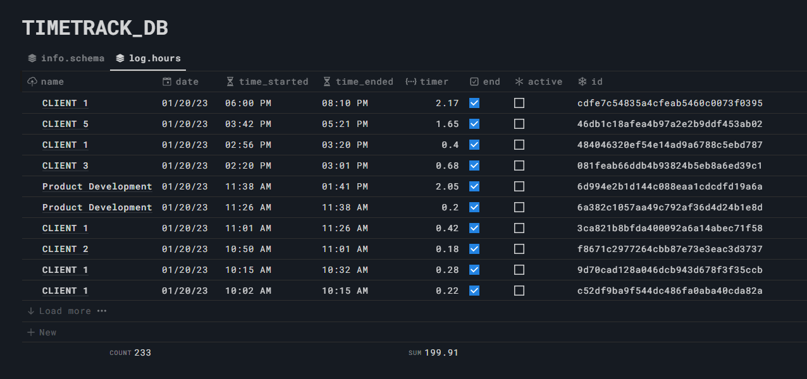
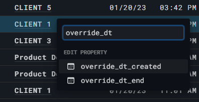
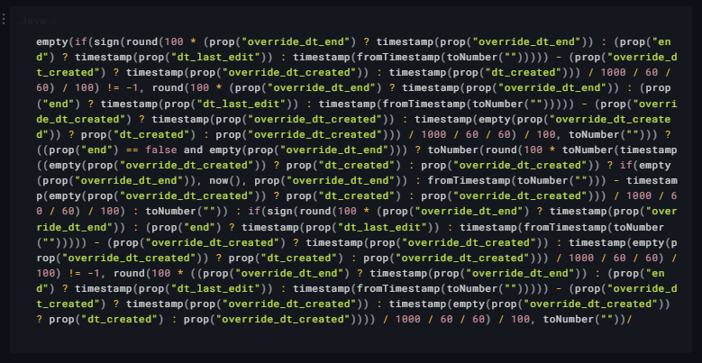
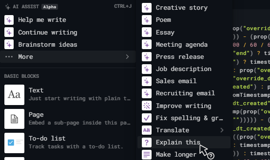
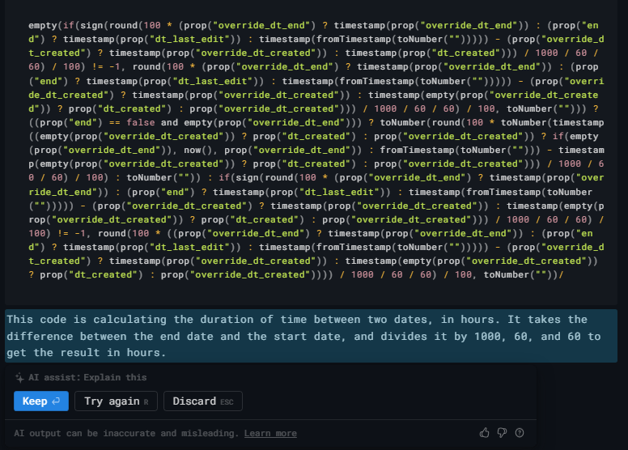
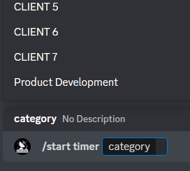
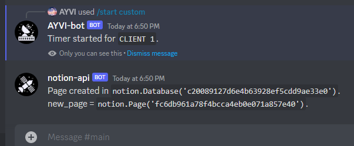
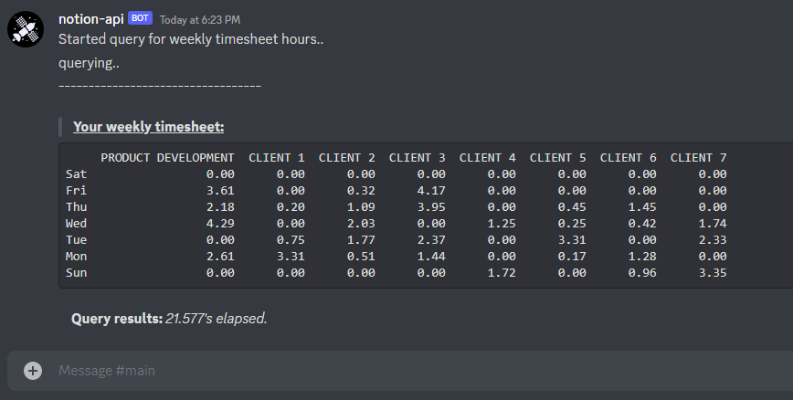

First version of my timetracking discord bot.  
The discord bot is built with crescent/hikari (which I am still very much trying to figuring out how to use correctly), while the requests to Notion's api are done with a wrapper that I'm also working on.  

The wrapper itself is uploaded separately, but it's not yet a package (nor complete), so I need to keep a copy with the bot for now.  

---
### Packages/Modules/Custom Scripts Used
```py
import os
import time
import dotenv
import typing
import asyncio
import logging
from functools import reduce
from operator import getitem
from datetime import datetime 
from datetime import timedelta 

import crescent
from crescent.ext import tasks
import hikari
from discord_webhook import AsyncDiscordWebhook
import numpy as np
import pandas as pd

import notion # custom wrapper.
import notion.query as query # ext. to above.
from timesheet import * # script for totalling weekly hours.
```

---
## Logic for Tracking Hours

The actual logging of hours can be done entirely on Notion. I chose to keep the logic for tracking time there because the bot is being worked on and still missing features, like overriding entries. It also isn't running 24/7 until I leave it hosted on a virtual machine. Considering I use this to track my work hours, I didn't want to have downtime.

The view in Notion:

  
<br></br>

The basic idea is;

- The timer starts when a page is created through `created_time` property.
- Once you toggle the `end` checkbox, it calculates the time until the `last_edit` property.
- Unfortunately this means that if the page was edited at a later time, then it would extend the timer until the latest edit, so

  

- I needed properties to override the start and end times incase any edits needed to be made, or entries had to be added after the fact.

- Notion's formulas for datetime don't play nice with actual datetime properties/objects or any mathmatical operations, so everything had to be converted to a timestamp. All the logic in the end - for calcuating time based on toggling the `end` checkbox, allowing overrides, adding blank values for errors, converting to hours, and rounding - ended up with this..

  

Now, I decided to try and let Notion's new AI explain this for me.
<br></br>

<p float="middle">
    
    
</p>


Honestly, not terribly disappointed.

I'll still add to that though - yes this was broken down into separate properties and was nowhere near this messy, but it added ~15 columns and was already running slow with a lot of entries, so I combined them into one. I have the breakdown. Somewhere.

---
## Discord Commands

There are 3 general commands for now.
- Create a page/time entry
- Check if there are any active entries
- End the current timer/by notion UUID

The whole point of this project was to save the time I spend tracking time, so for the sake of time, I have a command with preset options. Although there is a separate command for custom entries, should the need arise.

```py
WEBHOOK_NOTION_INTEGRATION = os.getenv('WEBHOOK_NOTION_INTEGRATION')

@bot.include
@start.child
@crescent.command(name='timer', description='Start new preset timer.')
async def start_timer(
    ctx: crescent.Context,
    category: typing.Annotated[str, crescent.Choices(
            hikari.CommandChoice(name="CLIENT 1", value="CLIENT 1"),
            hikari.CommandChoice(name="CLIENT 2", value="CLIENT 2"),
            hikari.CommandChoice(name="CLIENT 3", value="CLIENT 3"),
            hikari.CommandChoice(name="CLIENT 4", value="CLIENT 4"),
            hikari.CommandChoice(name="CLIENT 5", value="CLIENT 5"),
            hikari.CommandChoice(name="CLIENT 6", value="CLIENT 6"),
            hikari.CommandChoice(name="CLIENT 7", value="CLIENT 7"),
            hikari.CommandChoice(name="Product Development", value="Product Development"),
        ),
    ],
) -> None:
    new_page = notion.Page.blank(parent_instance=TIMETRACK_DB, content=category)
    
    global ACTIVE_TIMER_ID
    ACTIVE_TIMER_ID = new_page.id
    # global method is TEMPORARY 
    # still working out some issues with the query filters

    content = f"""
    Page created in `notion.Database('{new_page.parent_id}')`.\nnew_page = `notion.Page('{new_page.id}')`.
    """
    notification = AsyncDiscordWebhook(url=WEBHOOK_NOTION_INTEGRATION, 
                               content=content, rate_limit_retry=True, timeout=10)
    await notification.execute()
    await ctx.respond(f'Timer started for `{category}`.', ephemeral=True, flags=16) 
```


<p float="middle">
    
    
</p>

Ending and querying follow the same general idea. Examples can be seen in images or source.   

---
## Totalling Hours and Weekly Timesheet

The main pain point I was planning to eliminate was totaling up the hours so that I could quickly submit my timesheets each week.  
The cron job is set to run every Sunday. On that day, the query is built using `datetime.timedelta` so I can iterate through the last 7 days in request filter parameters.

```py
def construct_query(client: str, delta: int) -> dict[str, query.CompoundOr | query.CompoundAnd]:
    dt_delta: str = (datetime.now() - timedelta(days=delta)).strftime("%Y-%m-%d")
    query_payload = query.CompoundFilter(
        query.CompoundAnd(
            query.PropertyFilter.date(
                'dt_created', 'date', 'equals', dt_delta).compound,
            query.PropertyFilter.text(
                'name', 'rich_text', 'contains', client.upper()).compound,
            )
        )
    return query_payload

def get_hours(db: notion.Database, client: str, delta: int) -> _ArrayNumber_co | None:
    filters: str = notion.payload(construct_query(client, delta))
    response: dict = db.query(filters).get('results')
    try:
        return weekly_hours_array(response)
    except KeyError:
        logger.debug(KeyError, "No results in Query")
        return None

def weekly_hours_array(query_response: dict) -> _ArrayNumber_co:
    total = np.sum(np.append(np.array([]), 
                [x['properties']['timer']['formula']['number'] for x in query_response])
            )
    return total
```

I also want the columns with the different time entry names to be automatically populated so I don't need to manually add anything as new clients get added/dropped.

```py
def entry_list(db: notion.Database) -> set[str]:
    list_results = [r for r in db.query().get('results')]
    title_keys = ['properties', 'name', 'title']
    n_array = [reduce(getitem, title_keys, obj) for obj in list_results]
    n_iter = [array[1][0] for array in enumerate(n_array)]
    unique_names = set([name.get("plain_text").upper() for name in n_iter])
    return unique_names
```

The final function will add the last weeks hours, per day, for all unique time entry names.  

```py
TIMETRACK_DB_ID = os.getenv('TIMETRACK_DB_ID')
TIMETRACK_DB = notion.Database(TIMETRACK_DB_ID)

DAYS_OF_WEEK = ['Sat', 'Fri', 'Thu', 'Wed', 'Tue', 'Mon', 'Sun']

TOTALS = pd.DataFrame(index=DAYS_OF_WEEK)

def weekly_totals(time_entries) -> None:
    for client in time_entries:
        client_hours: list[_ArrayNumber_co | None] = []
        for days in enumerate(DAYS_OF_WEEK):
            client_hours.append(get_hours(db=TIMETRACK_DB, client=client, delta=days[0]))
        TOTALS[client] = client_hours
```
---
## Scheduled Cron Jobs

Returning the final dataframe had to be split up into 2 functions to avoid timeout issues.

At the scheduled time, The query will run, with the actual function happening _after_ the await.

The second function has the same cron schedule, as the smallest intervals I can set are by minutes. It begins at the same time and waits for the dateframe to populate.  

```py
@bot.include 
@tasks.cronjob('0 9 * * 0')
async def start_query_timesheet() -> None:
    notification = AsyncDiscordWebhook(
        url=WEBHOOK_NOTION_INTEGRATION, 
        content='Started query for weekly timesheet hours..')
    await notification.execute()
    # Query must run after await to avoid timeout. Est. time: 19.xx seconds.
    weekly_totals(time_entries=entry_list(db=TIMETRACK_DB))
 

@bot.include 
@tasks.cronjob('0 9 * * 0')
async def retrieve_query_timesheet() -> None:
    TIME_START = time.time()
    query_status = AsyncDiscordWebhook(url=WEBHOOK_NOTION_INTEGRATION, 
                                       content=f"querying..")
    while TOTALS.empty:
        await query_status.execute()
        await asyncio.sleep(7)

    content = f"""----------------------------------
    > **__Your weekly timesheet:__**\n```{TOTALS}```
    **Query results:** _{round(time.time() - TIME_START, 3)}'s elapsed._
    """
    notification = AsyncDiscordWebhook(url=WEBHOOK_NOTION_INTEGRATION, content=content)
    await notification.execute()
```

There are obvious issues with this current system, but until the bot is hosted on a persistant server, it'll do for now!

---
## Final result

  

I now save approx. 5 minutes at the end of each week adding up my hours!
