# Discord/Notion Timetracking Bot

Current version of my timetracking discord bot, using another side-project building a wrapper for Notion's API.  
The wrapper itself is uploaded to a separate repo, but it's not yet a package or complete, so a copy is kept locally here as well.

The bot is built with crescent/hikari, and hosted on a VM in GCP.  

---
### Packages/Modules Used
```py
import os
import dotenv
import asyncio
import logging
from datetime import datetime

import hikari
import miru
import crescent
from crescent.ext import tasks
from discord_webhook import AsyncDiscordWebhook
from discord_webhook import DiscordEmbed

from github import Github
from jsonpath_ng import parse

import notion
import notion.properties as prop
import notion.query as query
```

---
## Logic for Tracking Hours

Logging time can be done entirely on Notion. While the bot is hosted on persistant server, I chose to keep the logic for calculating hours there in the event of downtime, and the bot is still missing a few key features. Overriding start/end times and viewing a paginated list of recent entries still needs to be implemented.

The view in Notion:

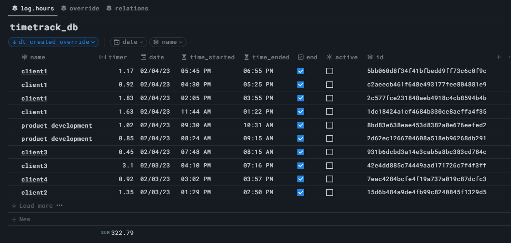  
<br></br>

- The 'timer' starts when a page is created, using the `created_time` property as start time.
- Toggling `end`, will stop the timer and calculates total duration using the `last_edit` property as end time.

Unfortunately this means that if the page was edited at a later time, then it would extend the timer until the latest edit, so additional properties to override start/end times are added.

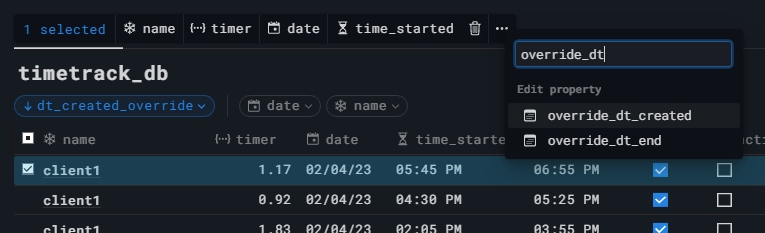  

Notion's formulas for datetime don't play nice with actual datetime properties/objects or any mathmatical operations, so everything had to be converted to a timestamp.  
All the logic in the end - for calcuating duration, allowing overrides, error handling, converting timestamps to hours, and rounding - ends with this.

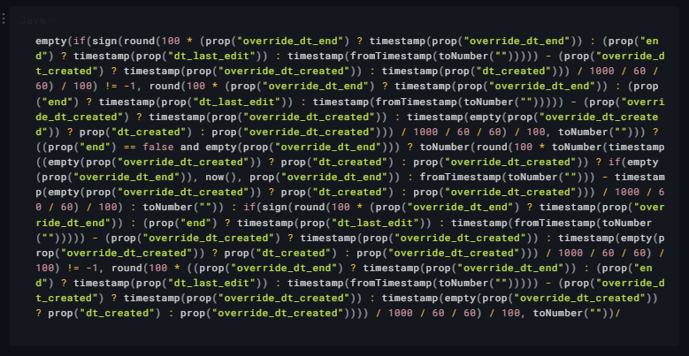  

I decided to try and let Notion's new AI explain this for me.

<p float="middle">
    
  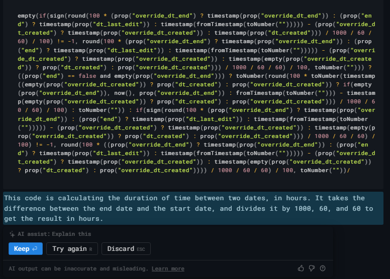  
</p>


Honestly, not terribly disappointed. This was originally broken down into separate properties, but all the additional columns caused the UI to slow down so I combined them into one. I have the breakdown. Somewhere.

---
## Discord Commands

There are 3 databases in Notion used by the bot.

```py
# individual time entries
TIMETRACK_DB = notion.Database(os.getenv('TIMETRACK_DB_ID'))
# table to sum all entries for each category
ROLLUP_DB = notion.Database(os.getenv('ROLLUP_DB_ID'))
# category names used for autocompleting dropdowns
OPTIONS_DB = notion.Database(os.getenv('OPTIONS_DB_ID'))
```

Each morning at 04:00, the bot will create a daily page in the rollup database for time entries to relate to.

```py
@bot.include 
@tasks.cronjob('0 4 * * *')
async def create_daily_rollup_page() -> None:
    new_rollup_page = notion.Page.create(ROLLUP_DB, page_title=f"{datetime.today().date()}")
    new_rollup_page.set_date('time_created', datetime.today())
```

### Starting a New Timer

New entries can be added at any time, but there is a table in Notion that's used to store common entry names.

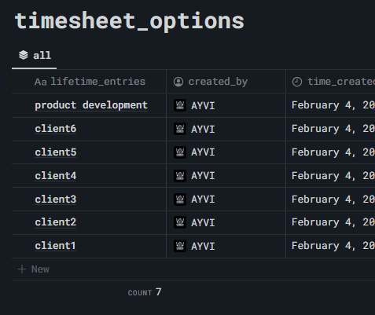

These can be added either through Notion UI, or in Discord with `/options add` and `/options delete`.

This column gets queried when using the `/start timer` command in Discord to autocomplete the available options.

```py
async def autocomplete_options(
    ctx: crescent.AutocompleteContext, option: hikari.AutocompleteInteractionOption
) -> list[hikari.CommandChoice]:
    r = OPTIONS_DB.query(filter_property_values=['lifetime_entries'])
    # grabs plain_text key from name column in notion.
    entries = [m.value for m in parse("$.results[*].properties..plain_text").find(r)]
    list_options = [hikari.CommandChoice(name=e, value=e) for e in entries]
    return list_options
```

The command will create a new page, and check to see if a rollup column has already been created or not.  
If the input name is a new category, then it'll create the relation between the timesheet database and the rollup database
that is used to calculate totals.

```py
@bot.include
@start.child
@crescent.command(name="timer", description="Start new preset timer.")
class start_timer:
    category = crescent.option(str, "Select a time entry", autocomplete=autocomplete_options)

    async def callback(self, ctx: crescent.Context) -> None:
        await ctx.respond(f'Starting timer for {self.category}..', ephemeral=True, flags=16)

        new_timer = notion.Page.create(TIMETRACK_DB, page_title=self.category)
        
        rollup_category = f"rollup_{self.category}"
        timer_category = f"timer_{self.category}"
        sum_category = f"sum_{self.category}"
        
        try:
            # checks to see if a related column already exists.
            TIMETRACK_DB.property_schema[rollup_category]
        except KeyError:
            # creates a new one if not found, and notifies the function may take longer.
            await ctx.edit("Creating new rollup properties..")
            # synced property name key has some bugs with notion api at time of commit,
            TIMETRACK_DB.add_relation_column(ROLLUP_DB.id, ' ', property_name=rollup_category)
            # so have to rename the synced property from default separately.
            ROLLUP_DB.rename_property(f"Related to timetrack_db (rollup_{self.category})", timer_category)
            ROLLUP_DB.add_rollup_column(timer_category, 'timer', prop.FunctionsEnum.sum, property_name=sum_category)

        # query's rollup table for today's date to get id for related column.
        params = query.PropertyFilter.text('name', 'title', 'equals', f"{datetime.today().date()}")
        result = ROLLUP_DB.query(payload=params, filter_property_values=['name'])
        related_id = [match.value for match in parse("$.results[*].id").find(result)]
        new_timer.set_related(rollup_category, related_id)

        _content_page = f"New page created in `notion.Database('{new_timer.parent_id}')`"
        _content_id = f"New page ID: `{new_timer.id}`."
        content = f"{ctx.user.mention}\n{_content_page}\n{_content_id}"
        await ctx.followup(content) 
```

<p float="middle">
  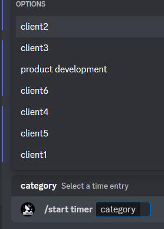  
  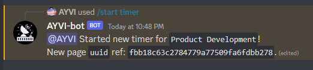  
</p>
<br></br>

---

### End & View Active Running Timers

Same as the autocomplete function used when starting a timer - the `/end timer` command will first query an active timers, 
and display the name and current duration.

```py
async def autocomplete_active_timers(
    ctx: crescent.AutocompleteContext, option: hikari.AutocompleteInteractionOption
) -> list[hikari.CommandChoice]:
    # query for active entries is limited to past week,
    # and filters properties returned to help reduce time.
    query_payload = notion.request_json(
        query.CompoundFilter(
            query.AndOperator(
                query.PropertyFilter.checkbox('active', 'equals', True),
                query.TimestampFilter.created_time('past_week', {}))),
            query.SortFilter([query.EntryTimestampSort.created_time_descending()]
            )
        )
    results = TIMETRACK_DB.query(payload=query_payload, 
                                 filter_property_values=['name','id','timer']
                                 ).get('results')

    list_responses = []
    if results:
        for obj in results:
            name = obj['properties']['name']['title'][0]['plain_text']
            id = obj['id'].replace('-','')
            timer = obj['properties']['timer']['formula']['number']
            display_name = f"Name: {name} | Duration: {timer}"
            list_responses.append(hikari.CommandChoice(name=display_name, value=id))
        return list_responses
    else:
        return [hikari.CommandChoice(name='No active timers to display.', value='null')]


@bot.include
@end.child
@crescent.command(name="timer", description="End any active timers.")
class EndTimer:
    active_timer = crescent.option(str, "Select an option to stop.", 
                                   autocomplete=autocomplete_active_timers)

    async def callback(self, ctx: crescent.Context) -> None:
        # without 'null' value, autocomplete search fails to load in discord.
        if self.active_timer == 'null':
            await ctx.respond(f"Nothing to stop!", ephemeral=True)
        else:
            await ctx.respond(f"Stopping timer...", ephemeral=True)
            active_page = notion.Page(self.active_timer)
            active_page.set_checkbox('end', True)
            await ctx.followup(f"Timer ended!")
```

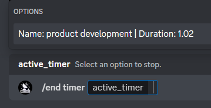  

This can be used both to end, or view what is running.  
Entries can also be deleted using the page's uuid and the command `/delete id`.  

---

## Total Hours and Rollup Table View

The view in the rollup table is automatically filled as time entries get added. 

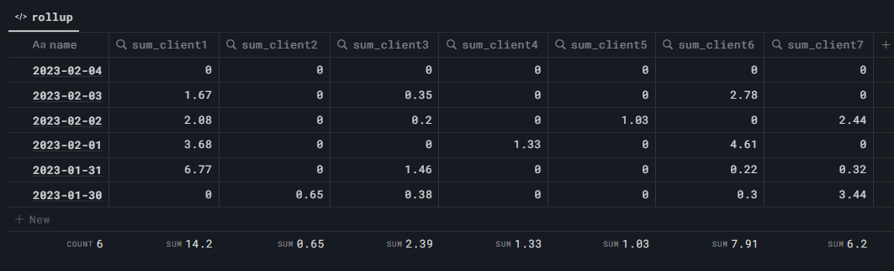  

I now save approx. 5 minutes at the end of each week adding up my hours!

---
### Additional and Planned Functions

There are currently 2 user commands.  
One to call link buttons to each database,
and one to call an embed with links to this repo/notion-api repo, with a timestamp for when it was last updated. 

<p float="middle">
  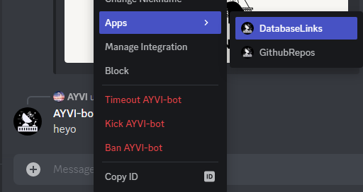  
  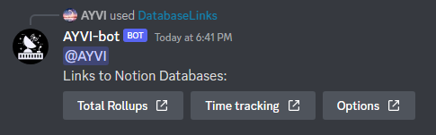  
</p>


3 text commands also exist for links to quickly view a few pages that I regularly checked while creating this bot and the wrapper.  
`--status` for url to Discord uptime status page.  
`--notionupdates` for url to latest feature releases in Notion.  
`--notionchangelog` for url to latest changes to Notion's API.  


Features that still need to be included as mentioned at the beginning of this doc, are overrides and viewing entries in Discord.  
And eventually I'd like to finish building the notion wrapper, and publish it on PyPI so I don't need to include the folder in here anymore.  
