The current working version of my discord bot used for logging hours and setting reminders through the Notion API. The wrapper for the Notion API is another side project I'm working on and is uploaded to a separate repo, but it's not complete or available to install as a package yet, so a copy is kept locally here as well.

The bot is built with [hikari](https://github.com/hikari-py/hikari), and uses [crescent](https://github.com/hikari-crescent/hikari-crescent) as a command handler. It runs on Google's [Compute Engine](https://cloud.google.com/compute), using a docker image hosted on Container Registry. 

**_It's not currently setup to be run on another machine or added to any other discord server_**. 

However these are both things I hope to have setup once it's complete!

---
## Timesheet Functions

Logging time entries can be done entirely on Notion. While the bot is hosted on persistant server, I chose to keep the logic for calculating hours there in the event of downtime, and the bot is still missing a few key features. Overriding start/end times and viewing a paginated list of recent entries still needs to be implemented.  

<div> <center> The view in Notion: <br> 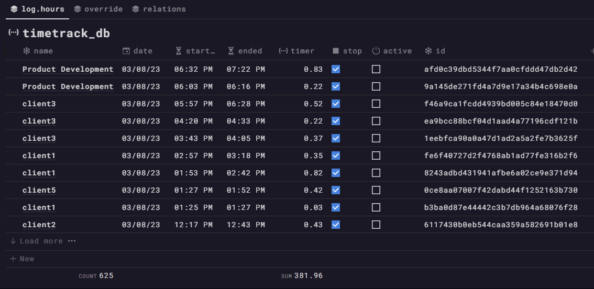 <br> </div>

- The 'timer' starts when a page is created, using the `created_time` property as start time.
- Toggling `end`, will stop the timer and calculates total duration using the `last_edit` property as end time.
- Additional properties are added to for calcuating duration, allowing overrides, error handling, converting timestamps (only way to calculate duration from `date` properties in Notion) to hours, and rounding.

These were originally split up into seperate properties, but this resulted in significant performance issues, and a lot of clutter - so they're all combined into one. I'll leave this up to Notion's AI to explain it for me and move on..

<div class="images">
    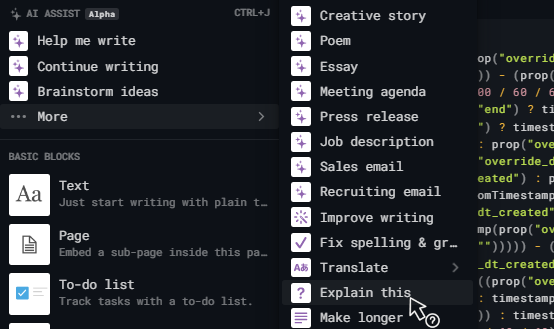 
    
</div>
<br>

---

### Start & Ending a timer

The options for timer categories are stored in a Notion database. They're added either through the commands `/options add` and `/options delete`, or by editing in Notion. If edits are made through the latter, the function that fills the command autocomplete has to be refreshed through the user-command `refresh-timesheet-entries`

Autocomplete functions fill in the available options for starting timers and ending active timers, or for viewing the hours on a running timer. 

<p float="middle">
  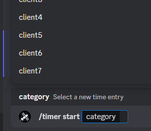 
  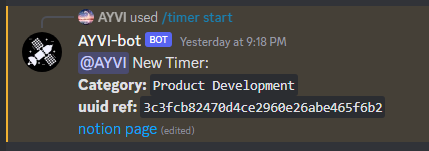 
</p>
<br>
<p float="middle">
  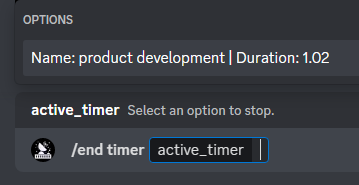  
  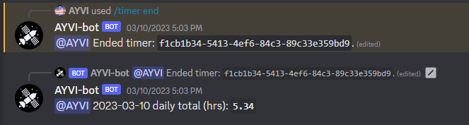  
</p>

A page is created in the rollup table each day at midnight:

```py
@plugin.include
@tasks.cronjob("10 0 * * *")
async def daily_rollup_page() -> None:
    # rollup page that time entries will relate to for totals.
    new_rollup_page = notion.Page.create(
        notion.Database(os.environ["NDB_ROLLUP_ID"]),
        page_title=f"{datetime.today().date()}",
    )

    dt = datetime.today().astimezone(new_rollup_page.tz)
    new_rollup_page.set_date("time_created", dt)
```

The pages containing the total for each timer are automatically set as a related ID to the sum column of that category.
If rollup columns and relations don't already exist, they're created the first that new category starts, and the daily total formula in Notion is appended with the new property. 

```py
@plugin.include
@timer.child
@crescent.command(name="start", description="Start a new timer.")
class TimerStart:
    category = crescent.option(
        str, "Select a new time entry", autocomplete=autocomplete_time_entry_options
    )

    async def callback(self, ctx: crescent.Context) -> None:
        await ctx.respond(f"Starting Timer..")

        ndb_timetrack = notion.Database(NDB_TIMETRACK_ID)
        new_timer = notion.Page.create(ndb_timetrack, page_title=self.category)

        await ctx.edit(
            "{}\n{}\n{}\n{}".format(
                f"{ctx.user.mention} New Timer:",
                f"**Category:** `{self.category}`",
                f"**uuid ref:** `{new_timer.id}`",
                f"[notion page]({new_timer.url})",
            )
        )

        rollup_category = f"rollup_{self.category}"
        timer_category = f"timer_{self.category}"
        sum_category = f"sum_{self.category}"

        ndb_rollup = notion.Database(NDB_ROLLUP_ID)

        try:
            # checking to see if a related column already exists.
            ndb_timetrack[rollup_category]
        except NotionObjectNotFound:
            # creating a new one if not found.
            ndb_timetrack.dual_relation_column(
                rollup_category, ndb_rollup.id, timer_category
            )
            ndb_rollup.rollup_column(
                sum_category, timer_category, "timer", prop.NotionFunctionFormats.sum
            )

            # adding new rollup property to total sum.
            expression = str(
                NAdict(ndb_rollup._property_schema).total.formula_expression
            )
            expression += f""" + prop("{sum_category}")"""
            ndb_rollup.formula_column("total", expression=expression)

        now = datetime.now().astimezone(new_timer.tz)

        # querying rollup table for today's date to get id for related column.
        query_filter = notion.build_payload(
            PropertyFilter.text("name", "title", "equals", now.date())
        )
        query_results = ndb_rollup.query(
            payload=query_filter, filter_property_values=["name"]
        )

        related_id = [str(NAdict(query_results).results_0_id)]
        new_timer.set_related(rollup_category, related_id)
        new_timer.set_date("override_start", now)
```

### Total Hours and Rollup Table View

The relations between these pages and the rollup columns configuration in Notion adds everything up into this final view:  

<div class="images"> 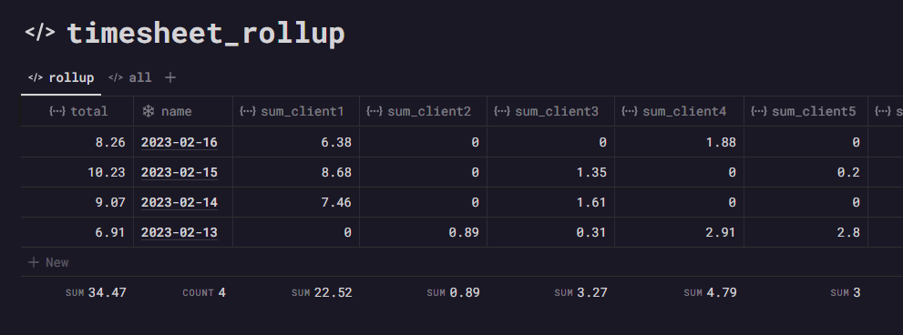 <br> </div>

---

## Reminder Functions

The bot uses [apscheduler](https://github.com/agronholm/apscheduler) to store and fire off the reminder functions. There are currently two being used; one to send the reminder in Notion, and one in a webhook to the main channel. 

The date field is passed to `dateparser.parse` to allow inputs such as "in 5 minutes".  

<div class="images"> 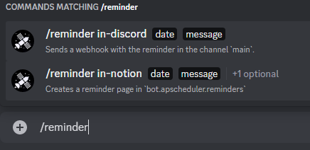 <br> </div>

Options still need to be added for selecting a channel for discord reminders, and users for both. 

<figure> <center>
    <div class="images">
        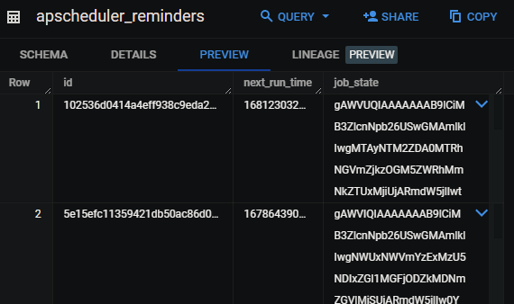 </div>
        <a href="https://github.com/googleapis/python-bigquery-sqlalchemy" title="This library is only compatible with SQLAlchemy versions < 2.0.0. If an incompatible version is already installed, it will be replaced with SQLAlchemy==1.4.xx">The state of each job is stored in a bigquery table using a SQLAlchemy dialect for Google BigQuery. </a>
        <figcaption>This uses the same fields that apscheduler would use in any other RDBMS:</figcaption>
        <figcaption>a job id, the next run time in a UTC timestamp, and the function to execute converted into a byte stream.</figcaption>
        <br>
</figure>

<br>

A second table is also used to store the byte stream for the Notion page that's created as a record of the reminder, containing the run time and status to quickly refer to.
When the job fires, this table is queried to retrieve the page, reconstitute it and trigger the reminder.

<div class="images"> 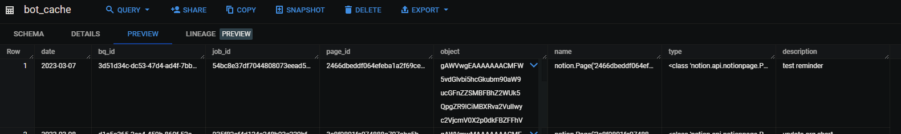 <br> </div>

<br>

And finally a table in the Notion UI to keep record of the jobs and current status, with the page's that the bot will mention at the next run time.

<div class="images"> 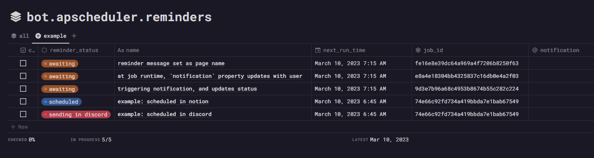 <br> </div>

---
